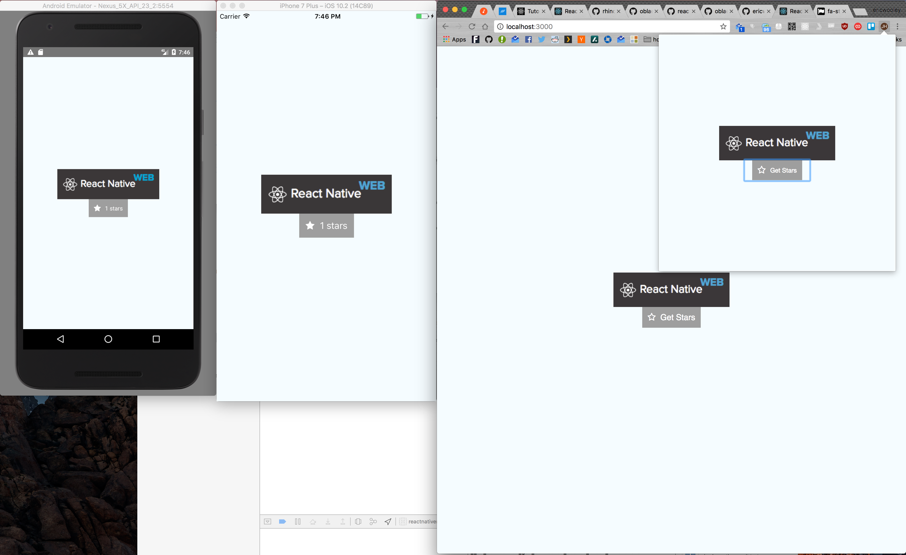

React Native Web Redux Starter Kit
==================================

## Quick Links
1. [Dependencies](#dependencies) √ 
2. [Onboarding](#onboarding) √
  * [Libraries](#libraries) √
3. [Development](#developing) √
4. [Deployment](#deployment) ¬
5. [Blueprints](#blueprints) √
6. [References](#references) ¬
7. [Notes](#notes)

Dependencies
------------
1. OSX with xcode
2. Node >= 6 (I would use nvm or n)
3. Yarn >= 0.21.3

Onboarding
----------
Make sure you understand react/redux/redux-sagas. (Links in the libraries section)

Take a quick look at the directory structure. (explanations follow)
### Directory Structure
```bash
├── android                                           # Android build project
├── app.json
├── blueprints                                        # Blue print folders
│   ├── component                                     # Blue print for component `redux g component <component name>
│   ├── container                                     # Blue print for container `redux g component <container name>
│   ├── saga                                          # Blue print for saga `redux g component <saga name>
│   └── scene                                         # Blue print for scenes `redux g component <scene name>
├── index.android.js                                  # entry point for android
├── index.ios.js                                      # entry point for ios
├── index.web.js                                      # entry point for web
├── ios                                               # IOS build project
├── jsconfig.json                                     # VSCODE JSConfig Project
├── package.json                                      # NPM package file for build scripts.
├── src                                               # app src file
│   ├── __tests__                                     # root tests folder
│   │   ├── __snapshots__                             # storyshots snapshots folder
│   │   └── storybook.test.js                         # Initialization for storyshots
│   ├── assets                                        # Images etc..
│   ├── components                                    # React Components
│   │   ├── index.js                                  # exports all components
│   │   └── <component name>                          # root folder for component
│   │       ├── __tests__                             # component test folder
│   │       │   └── <component name>Component.test.js # component test file
│   │       ├── <component name>Component.js          # component file
│   │       └── <component name>Component.story.js    # component story file
│   ├── redux                                         # Redux files
│   │   ├── reducers                                  # redux reducers
│   │   │   ├── __tests__                             # tests for reducers
│   │   │   │   └── <reducer name>Reducer.test.js     # test file for reducer
│   │   │   └── <reducer name>Reducer.js              # redux reducer
│   │   ├── sagas                                     # redux saga files
│   │   │   ├── index.js                              # exports all saga files.
│   │   │   └── <saga name>                           # Saga container
│   │   │       ├── __tests__
│   │   │       │   └── <saga name>Saga.test.js       # Saga test file
│   │   │       └── <saga name>Saga.js                # Saga
│   │   └── store.js                                  # creates and configures the redux store
│   ├── scenes                                        # Scenes (maps to routes, similar to views)
│   │   ├── <scene name>Scene.js                      # Scene component, should only compose containers
│   │   │   ├── <scene name>Scene.js                  # Test files for scenes
│   │   └── index.js                                  # Exports all scenes
│   └── stories.js                                    # Imports and exports all other stories. 
│   ├── services
│   │   └── <service name>Service
│   │       ├── <service name>Service.js
│   │       └── <service name>Service.test.js
├── storybook                                         # Native storybook config
├── test_config                                       # Setup files for jest
├── web                                               # Web config files for react-native-web
└── yarn.lock                                         # Locks all libraries in place. 
```
* Components
  Components are like the View in MVC. It should only accept props, and output JSX, with generalized callback props (onClick, onHover, onSomethingCustom, etc...). Think of components like your own personal html framework, these shouldn't know anything about the state of the app.

  1. Stories
  Stories are react storybook stories, and are effectively documentation for the components. 
    
    * run `yarn storybook:web` and open [http://localhost:9001/](http://localhost:9001/) to open the storybook ui
    
    * run `yarn storybook:web` and open [http://localhost:7007/](http://localhost:7007/) and open the app to get the stories in the simulator

  2. StoyShots
  Storyshots convert storybook stories to jest snapshots. So that when you run unit tests, it checks the underylying dom elements havn't changed.
  
* Containers (Smart Components)
  Containers are components that use redux-connect to map a components props to redux state and actions.
    
* Scenes
  Scenes are components that are loaded via react native navigation. It should be composed entirely of smart components.
  
* Services
  Services are configurable (often singleton) objects which can be imported into other parts of the app. There is no boilerplates for this because each
  case for a service is probably too different.

* Unit Tests
  Make sure you understand jest, unit tests, and TDD in general. This project has githooks which check your test on commit.


### Libraries
Become very familiar with each of these libraries.

1. [React](https://facebook.github.io/react/)
  * [shouldComponentUpdate](https://facebook.github.io/react/docs/optimizing-performance.html#shouldcomponentupdate-in-action)
  * [Higher Order Components](https://facebook.github.io/react/docs/higher-order-components.html)
  * [React PropTypes](https://facebook.github.io/react/docs/typechecking-with-proptypes.html) should be stricly enforced.

2. [redux](http://redux.js.org/) - Yes, read all of it.
  * [Excellent supplimentary course by the creator of redux](https://egghead.io/courses/getting-started-with-redux)

3. [redux sagas](https://redux-saga.github.io/redux-saga/) are used instead of redux-thunk.
  * requires a basic understanding of [es6 generators](https://davidwalsh.name/es6-generators)

4. [React native](https://facebook.github.io/react-native/)
  * This project also builds on this using [react-native-web](https://github.com/necolas/react-native-web)
    which is a reimplementation of react-native to make it run in a browser.

5. [react-native-elements](https://github.com/react-native-training/react-native-elements) Basic semi-presytled components to make things more usuable.
  * [react-native-vector-icons](https://github.com/oblador/react-native-vector-icons#installation) is installed, default setup only includes the font for font-awesome.
  * [Find your icons here](http://fontawesome.io/icons/)

6. [Recompose](https://github.com/acdlite/recompose) High Order components so that you can just use function based components

7. [Jest](https://facebook.github.io/jest/) Unit test framework, integrates with storyshots instead of jest snapshots

8. [StoryBook](https://github.com/storybooks/react-storybook)/[Storyshots](https://github.com/storybooks/storyshots)
used for individual component development, and to take snapshots of the UI, like jest snapshots.

9. [React Navigation](https://reactnavigation.org/docs/intro/) - Native code excellerated navigation framework

Development
-----------
1. Recommended Editor: [vscode](https://code.visualstudio.com/)
  * There are recommended extensions in the .vscode folder. 
  * Make sure your editor respects the [.editorconfig file](http://editorconfig.org/)
  * Make sure your editor uses the eslint linter.
  
2. Development commands
  * `yarn dev:ios`: run the react-native app in IOS
  * `yarn dev:android`: run the react-native app in ANDROID
  * `yarn dev:web`: run the react-native app in WEB
    You can open chrom://extensions, enable developer mode, and load web/chrome-ext as an unpacked extension. It should load the webpack build server just like developing in web.

3. Development Workflow 
  * Start by identifying which components you need and start react-storybook `yarn storybook:web` and open [http://localhost:9001/](http://localhost:9001/)
    1. Develop the component, and create comprehensive tests.

  * Create containers to wrap them to state, as needed (which can still be done via creating stories in storybook)
    1. This is also a good time to develop any sagas or reducers you need.
    
  * Kill storybook and run `yarn dev:web` and open [http://localhost:3000/](http://localhost:3000/)
    1. Create or open the view you want to develop, navigate there in your app, and happy developing!

  * Once you are happy with the way it looks in web, open it in ios and android, to make sure you didn't miss/break something.
  
  * At this point your unit tests are probably broken from storyshots. `npm run test` and take a look through the broken stories to make sure everything is acceptable. If not, fix whats broken, if so run `npm run test:update` to accept the new DOM changes, and make sure the rest of your tests pass.

  * TIP: when running tests run `npm run test -- --watch` to have jest watch your test files and only run the ones that change.
Blueprints
----------
This project takes advantage of the [redux-cli](https://github.com/SpencerCDixon/redux-cli) project. Which allows you to commit your own template files for 
generating. 

* component -  generates all tests/story/code boilerplate needed for a component. All files are placed in src/components.

  - EG: `redux g component test`

* container -  generates all tests/story/code boilerplate needed for a container. All files are placed in src/container.

  - EG: `redux g container test`

* saga -  generates all test/code boilerplate needed for a saga. All files are placed in src/saga.

  - EG: `redux g saga test`

* scene - generates all test/story/code boilerplate needed for a scene. All files are placed in src/scene.

  - EG: `redux g scene test`


Deployment
----------
TODO

References
----------
TODO



Notes
-----
Currently we are using react-native 0.41.x because 0.43.x depends on an [alpha version of react](https://github.com/facebook/react-native/issues/13314). Once that is resolved, we will upgrade to 0.43.x. 0.42.x is has some severe networking bugs.
